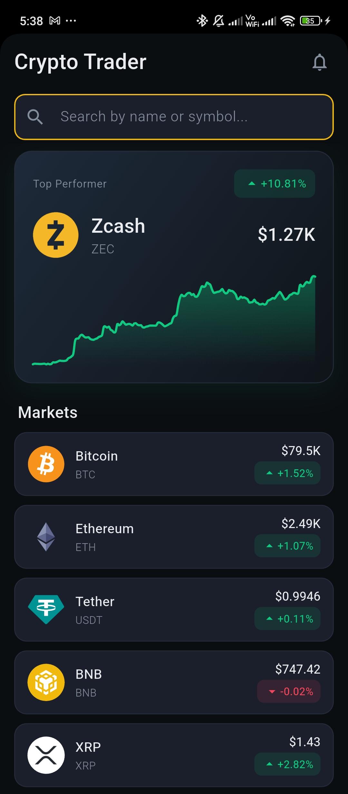
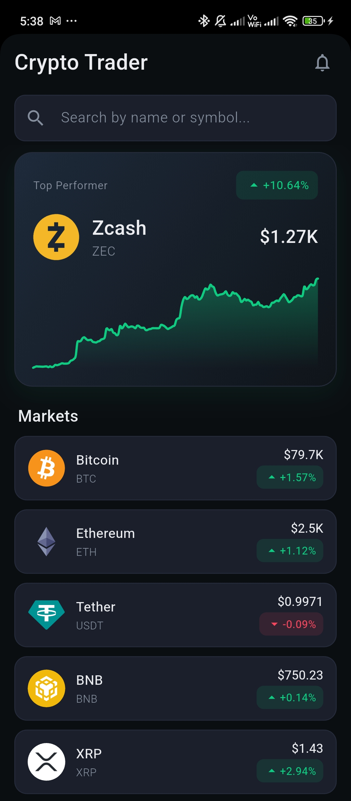
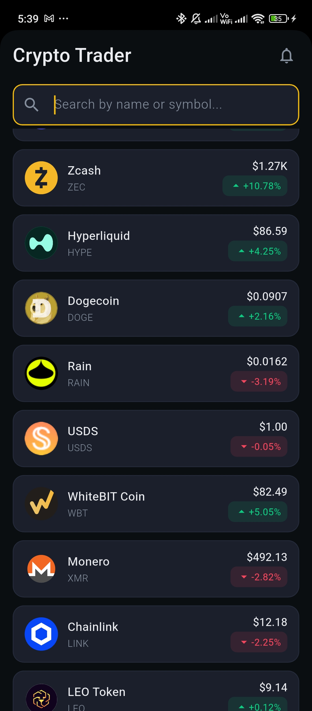

# Crypto Trader

A production-ready Flutter cryptocurrency trading and tracking application with live market data, simulated price movements, and offline mock capabilities.

## Overview

Crypto Trader provides a seamless and responsive user experience for monitoring top cryptocurrency markets. It pulls live market data via the CoinGecko API, visualizes trends through dynamic sparkline charts, and incorporates a live price simulation feature to demonstrate real-time data handling capabilities. The app is built with scalability and clean architecture in mind, ensuring ease of maintenance and testability.

## Features

- **Live Market Data**: Fetches real-time cryptocurrency data including current prices, market cap, and 24h percentage changes.
- **Dynamic Price Simulation**: Visually simulates live price fluctuations on top of the API data.
- **Search Functionality**: Quickly filter through assets by name or symbol.
- **Offline Mock Data Fallback**: Automatically defaults to offline demo data when network connectivity is absent or API rate limits are reached.
- **Pull-to-Refresh**: Easily reload market data on demand.
- **Custom Dark Theme**: Provides a modern, dark aesthetic optimized for readability.
- **Loading & Error States**: Smooth shimmer effects during data loading and graceful error handling with retry mechanisms.

## Screenshots

<p align="center">
  
  &nbsp;&nbsp;&nbsp;
  
  &nbsp;&nbsp;&nbsp;
  
</p>

## Tech Stack

- **Flutter / Dart** (SDK ^3.8.0)
- **State Management**: Riverpod (`flutter_riverpod`)
- **Networking**: REST APIs using the `http` package
- **UI Components**: `fl_chart` (graphs), `shimmer` (loading animations), `cupertino_icons`
- **Data Formatting**: `intl`

## Architecture

The application implements a layered architecture pattern prioritizing separation of concerns:

- **Presentation Layer (`screens/`, `widgets/`)**: UI components and layouts.
- **State Management (`state/`)**: Riverpod controllers bridging UI and business logic.
- **Data/Repository Layer (`repositories/`)**: Abstracts data sources (API vs. Mock data fallback).
- **Service Layer (`services/`)**: API interaction and network requests (`CryptoApiService`).
- **Models (`models/`)**: Strongly typed data classes (`CryptoAsset`, `AssetsState`).

## Project Structure

```text
lib/
├── core/
│   ├── constants/
│   ├── errors/
│   └── theme/
├── models/
├── repositories/
├── screens/
├── services/
├── state/
├── utils/
└── widgets/
```

## Key Implementation Details

- **State Management (Riverpod)**: Uses `StateNotifier` and providers to handle asynchronous data streams and application state cleanly without deeply nested widgets.
- **API Integration**: Encapsulated networking logic via `CryptoApiService` with robust error handling mapping HTTP status codes to `AppException` objects.
- **Mock Fallback Strategy**: The `CryptoRepository` gracefully intercepts network failures and serves reliable local dummy data (`MockData.fallbackAssets`) to ensure the UI remains testable and responsive.
- **Simulated Real-time Data**: A `Timer` based periodic tick in `AssetsController` simulates live price movements by applying randomized percentage deviations to asset values dynamically.

## Getting Started

1. Clone the repository
2. Navigate to the project directory:
   ```bash
   cd DemoApp
   ```
3. Install dependencies:
   ```bash
   flutter pub get
   ```
4. Run the application:
   ```bash
   flutter run
   ```

## Configuration

This project connects to the public [CoinGecko API v3](https://docs.coingecko.com/v3.0.1/reference/introduction) via the `ApiConstants` configuration file located at `lib/core/constants/api_constants.dart`. 
No authentication keys are required for the public endpoints used in this application.

## Build

To build the project for your specific platform, use the standard Flutter build commands:

**Android APK**
```bash
flutter build apk
```

**Android App Bundle**
```bash
flutter build appbundle
```

**iOS**
```bash
flutter build ios
```

## Dependencies

- `flutter_riverpod`: For predictable state management and dependency injection.
- `http`: Composable, Future-based library for making HTTP requests.
- `fl_chart`: For rendering dynamic and customizable sparkline charts.
- `shimmer`: To enhance UX with modern loading indicators.
- `intl`: For localized number and currency formatting.

## Future Improvements

- Add persistent local storage (e.g., Hive or SharedPreferences) to cache API responses and save user preferences.
- Implement user authentication to allow users to build a personalized portfolio of favorite assets.
- Integrate WebSockets for genuine real-time market data streaming rather than simulation.
- Expand test coverage with widget and integration tests.

**Author:** Abhishek Lacheta  
[GitHub Profile](https://github.com/Abhishek-lacheta)
